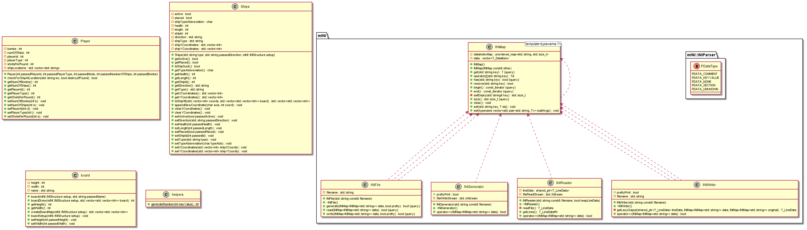

# ADA Ship
## Advanced Programming - Kieran Caruana

[Replit Link](https://replit.com/@KieranCaruana/AdaShip#README.md)

This is a game of battleships written in C++

## Summary and Review of the Problem:
I was tasked with creating a game of Battleships in C++. There was many differnent game modes that I was aiming to achieve, so I needed to ensure that my code could by reused as much as possible to acheieve all the game modes. This way even if the game modes couldnt be implemented within the time frame, I my code would still be written in a way that it could be scaled up to deal with the gamemoeds down the line. Because of this, I quickly decided that I needed to have a player class, ship class and a board class, this means each of these could be an object allowing me to infitely create more of each of them if I ever needed to. This also allowed me to store huge amounts of details about particular things, for example ships could have there own health and alive status, making it very easy to check if they were sunk. I also decided haveing a gameloop class would be helpful as then theoretically I could have mutliple games running at once, which could be useful if I ever decided to add networking to the game and make it online multiplayer, although this is outside the scope of the requirements, but its good to future proof.

## UML Diagram

## Inital Plan
As I already breifly covered my plan was to have 3 main classes; Player, Ships, Board. I felt this would allow me the flexability I needed to create more objects of each type. I also start projects with the aim to make the code as scalable as possible so breaking these three main aspects of the program up seemed very obvious to me. I also knew that having all the ship objects being easily accessible would be important, this would allow me to run checks on all the players ships, which would need to be done for example, to detect if a player has won. I also knew having a helper class would be needed as with most projects its useful to have small snippets of generic code saved to call to do the small tasks that keep coming up.

## Overal Approach
My overall approch didnt end up being to far away from what I had initally planned. I did end up with the 3 main classes, Player, Ships and Board. And I did run the game inside its own gameloop object. I feel this approch worked well and did make the task acheivable, however now it is completed there are a few things I would change. Most noteably would be the use of inheritance for the player. My way did work, however, I realse now that having a player class with default methods for it, and then an AI and a Human class the inherited Player class would have made the code shorter and more efficent. What I did instead was assign an attribute to the player object saying whether it was an AI or a Player and running different parts of code based on that check. What I should have done, is have them as child classes of Player and then override the Player methods with there own one, then I wouldnt have to check as the method that gets run will automatically be appropriate for the player type. 

## Development Strategy
My devleopment strategy was to work one task at a time, as you can see from the breakdown later in the readme, I had clear tasks that needed completing, I would choose one and get it done so I could tick it off the list. This approach is somewhat similar to a agile scrum based approach, where you have the big overall epic broken down into smaller tickets that you focus on one at a time. You can see evidence of this approach in my commit history, as I usually commited after completing one of these tickets.

## Approach To Quality
My approach to quality was to ensure things were done consistantly throughout the game. So menus will have a set style, inputs are done in a consistant way etc. I feel conistancy implies attention to quality. I also added lots of validation rules to ensure that users cant get trapped in anything they cant get out of inside the program. My regular commits to Git also ensured qulaity as it allowed me to take risks with confidence that if I make a mistake or cause a terrible bug, I can roll back to a previous stable version.

## Analysis and Breakdown of Overall Task

- [x] Inherits settings from adaship_config file.
  - [x] Config file is an INI file 
  - [x] Config file contains sections Board and Boat
  - [x] Board Section
    - [x] Size X
    - [x] Size Y
  - [x] Ship Section
    - [x] Ship name and Ship Length
- [x] Main Menu
  - [x] One Player VS Computer
  - [ ] Two Player Game
  - [ ] One Player VS Computer (salvo)
  - [ ] Two player game (salvo)
  - [ ] One player v computer (hidden mines)
  - [ ] Two player game (hidden mines)
  - [ ] Computer v computer (hidden mines)
  - [x] Quit
- [x] Players
  - [x] All players are created as objects regarless of AI or Human
- [x] Ship Placements
  - [x] Ships all added as new objects
  - [x] Auto-place (All)
  - [x] Manual
  - [x] Auto-place (Individual Ship)
  - [x] See status of ships placed via ship overview menu
- [x] Grids
  - [x] Each grid/board is its own object
  - [x] See you gameboard
  - [x] See opponents gameboard
  - [x] Formatted Tables for Data
- [x] Validation
  - [x] Validates user input
  - [x] Validates AI input
- [x] AI Setup
  - [x] Completes valid setup automatically with validation still 
- [x] Players Turn
  - [x] Their own, current and up to date ship and targetboards are displayed as well aligned tables
  - [x] Players are able to ‘fire’ a single torpedo at a valid location using the single notation coordinate
    - [x] If the location is invalid the player is asked to re-try.
  - [ ] Auto ‘fire’ option; this option targets and ‘fires’ at valid locations.
  - [x] Players are clearly notified of a ‘hit’ or ‘miss’ (or win) based on the outcome of their turn.
  - [x] Players are able to quit the game (if not already won).
  - [x] Players are required to ‘press a key’ to end their turn.
- [x] Computers Turn
  - [x] Its own, current and up to date ship and target boards are displayed as well aligned tables.
  - [x] It uses its own up to date ‘targetboard’ to randomly ‘fire’ a torpedo at a valid location
  - [x] A clear notification of a ‘hit’ or ‘miss’ (or win) based on the outcome is shown.
  - [x] Players are required to ‘press a key’ to end their turn.

## License

**Created and Owned by Kieran Caruana**